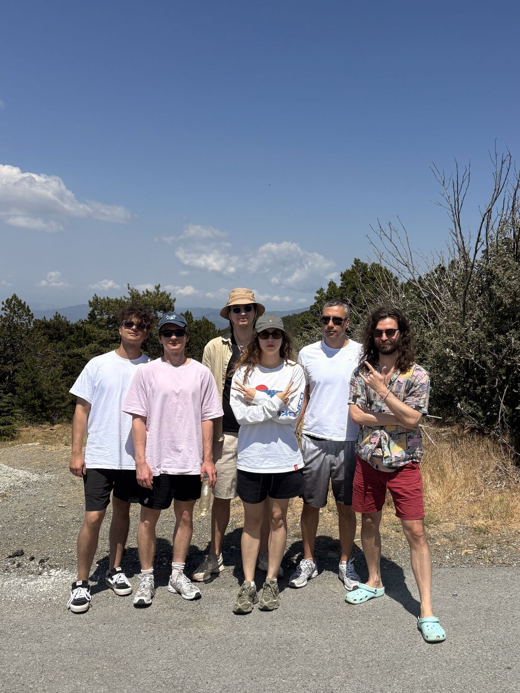

This is roughly the talk I gave on how we work at BloodGPT — about ten minutes spoken, plus Q&A. I cleaned it up for the page.

## Context

I'm Artem, from BloodGPT. We're about twenty people, building AI-driven interpretation of medical lab results. We came together *after* ChatGPT already existed — which makes us a very young team in a specific way. Just as Gen Z grew up as the digital-native generation, by the same analogy we grew up as an AI-native team.

> **native** — built in from the start, natural to the environment.

Like any young team, we are excellent at many things. Process is not one of them.

We tried the classic playbook: Agile, Scrum, sprints, Jira tickets. Every time, the process fell apart under the speed at which a startup actually ships product and grows the business.

<blockquote class="pull-quote">
  
"We're an AI-native company. The native material for AI is text. No text — we work the old way."

  <footer>Ildar B. · BloodGPT</footer>
</blockquote>

## Communication: we stopped pretending we take notes

I'll start with something that sounds small but fundamentally changed how we work — meeting notes and transcripts.

Before, small things got lost or forgotten. Across the whole team, those small things compounded into meaningful drift from the plan. Now every meeting is transcribed automatically and posted to a Slack channel — open, searchable, permanent. Anyone can catch up on what they missed.

**Auto-summaries.** The AI pulls out action items, decisions, and open questions, and drops them straight into the channel. We don't even have to read the transcript.

Beyond internal syncs, this works remarkably well for customer calls. Here's my favorite wow moment: once we started archiving transcripts of customer conversations, the developers — who used to receive requirements through a broken telephone — could finally see in detail what was discussed, what the customer actually wanted, what the nuances were. It completely changed the quality of how we understand problems. No more *"the PM said something about a button"* — there's a verbatim customer quote with context.

The same thing happens across teams. As a developer, you can read the marketing or sales sync and actually understand what hurts for them and where the company is heading.

Once you have this foundation, you can drop Claude into Slack and the resulting wiki's quality and coverage start to surprise you — with near-zero effort. Long threads, chaotic discussions, need to remember what was decided a month ago? *We have Claude in Slack.* Summarize a hundred-message thread? Find the glucose threshold? Pull action items out of a noisy channel? Done. Even our ugliest threads become searchable wisdom.

The cultural shift is real. We stopped requiring attendance at every meeting. Missed the standup? Read the transcript. Skipped product review? Read the transcript. It's not perfect — you do lose the hallway conversations — but for structured meetings, it's ninety percent of the same value and fully compatible with an afternoon nap.

## Task tracking: from transcript to ticket, without bureaucracy

Here it gets interesting. We connected a task tracker to Slack with discussion-history sync. Suddenly we had a process that didn't require us to be good at process.

The cycle looks like this:

1. **Meeting happens** → auto-transcript.
2. **AI extracts tasks** → *"From the backend sync: update the FHIR parser, add rate limiting, fix the duplicate check."*
3. **One click in Linear.** Anyone in the Slack thread clicks *Create Task*. It's pre-filled with context, suggests an assignee, links the transcript segment. We don't write descriptions. The AI was there.
4. **Discussion continues.** *"Wait, I thought rate limiting was 100 req/min, not 50?"* Search the transcript. Decide. Update the ticket. No more *"per my last email."*
5. **Agent loads context.** When someone picks up a task, our AI agent loads the Linear ticket, the full transcript, the Slack thread, the related code. It remembers everything so we don't have to.

### A real maturity signal: reporting

You know when this integration started being genuinely valuable? When we incorporated the company in the US and needed to file capex/opex reports. For anyone who has dealt with American accounting, this is usually the moment a team starts rolling out time trackers and the bureaucracy everyone hates.

We exported from Linear and GitHub, fed it into Claude, and got the report we needed.

## What works (and what we pretend works)

### Actually works

- **Transcript-based memory.** A searchable history of every conversation is a game-changer.
- **AI code review.** Catches bugs we would have missed.
- **Auto-extracted action items.** Stops small items from slipping.
- **One-click ticket creation.** Slack to Linear in seconds, with context preserved.
- **Agent-loaded task context.** Pick up any task and you immediately know what's going on.

### Doesn't work (yet)

- **Auto-creating tickets from meetings.** A line item in a transcript is clear. Automated ticket creation, on the other hand, turns into spam — there's no filter between *meaningful* and *noise*, and every "we should think about this" becomes a ticket. Manual curation is still required.
- **Specs → automated code changes.** Write a spec, get the change implemented? No.
- **Fully autonomous agents.** We don't have a single one in production. AI works either as a partner — a copilot, like Claude Code — or as a pipeline (code review, meeting summaries, and so on). Not as an independent operator.
- **Agentic browser testing.** Slow and unreliable. Writing stable Playwright tests is faster and easier.

---

That's roughly where we are. The thread tying it all together is that AI is not a feature we bolted onto the team — it's part of the substrate the team grew on top of. The pieces that work are the ones that replace something we were never going to do well anyway: writing good meeting notes, keeping context fresh, remembering decisions. The pieces that don't work, mostly, are the ones where people imagined the agent could replace judgement. It can't, at least not yet.
