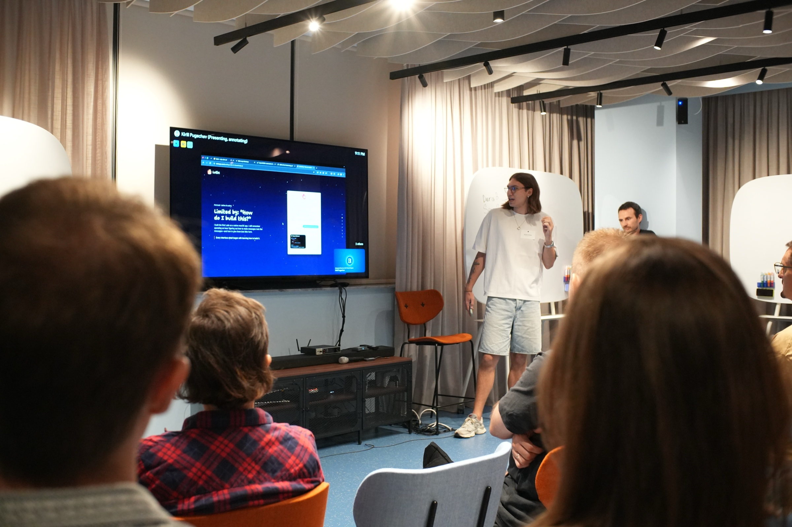
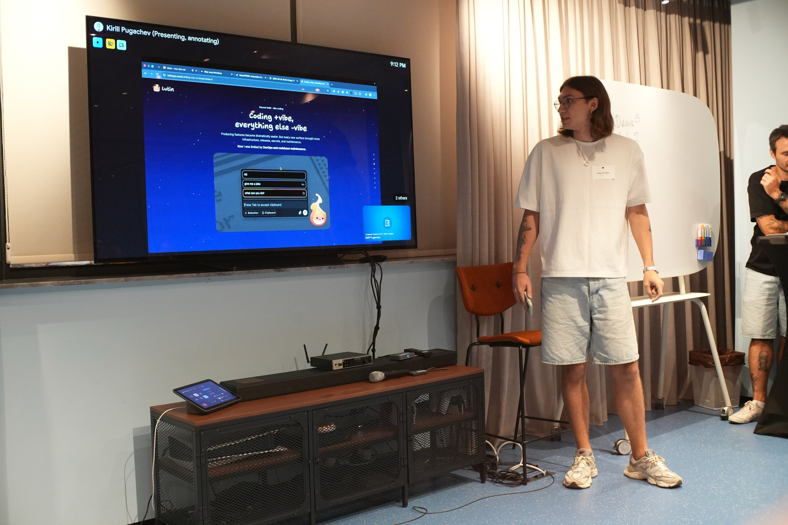
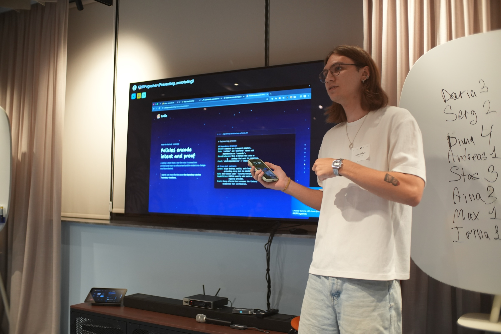
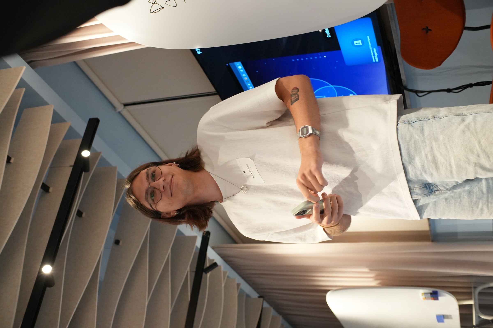

This is a cleaned-up version of a talk I gave at a meetup organized by [Vibe Coding Club](https://www.linkedin.com/company/vibe-coding-club/) and [JetBrains](https://www.linkedin.com/company/jetbrains/).

I already had an idea for the talk, but then Kirill sent the speakers this prompt:

> Things I built with AI that I never thought I’d be able to build.

That gave me the idea to put a retrospective spin on the story. So: why did I build Lutin three times?

  <iframe src="https://lutin.app/building-lutin-3-times" title="Why I Built Lutin Three Times presentation slides" loading="lazy" allowfullscreen style="display:block;width:100%;aspect-ratio:16/9;border:0;border-radius:0.5rem;background:#0a0a1a;"></iframe>
  
<a href="https://lutin.app/building-lutin-3-times">Open the presentation full-screen</a>

## Build #1: limited by “How do I build this?”

Since ChatGPT came out in November 2022, I’ve had one idea stuck in my head: why do I need to open a separate window or tab to interact with an AI assistant?

My first attempt at answering that question was a native macOS app, built with my bare hands. Every interface detail began with learning how to build it. I remember spending an hour figuring out how to make messages look like messages—and how to give them that little form.

I made the app and used it for a while. But prototyping is fast and fun; turning a prototype into a daily driver is not. I had to put in more and more time, and eventually the project became a burden.

So I dropped the idea for a while.

## Build #2: coding +vibe, everything else -vibe

Then vibe coding happened, and I decided to give the idea another try.

It was awesome. With AI as a copilot, I chose a technology I had never touched before, built a prototype in one evening, and spent a couple of weekends refining it.

Coding was no longer the only thing on my plate. Deployment, distribution, and marketing were suddenly open to me instead of being locked behind months of writing code by hand.

But there were two problems.

First, I still had to do all the non-coding work with my bare hands. Producing features had become dramatically easier, but every new surface brought more infrastructure, releases, secrets, and maintenance.

Second, Claude duplicated code all over the codebase. Maintaining a growing product started to feel like filling a bottomless pit. Vibe coding was fast and cheap, but it could not produce correct, maintainable work consistently.

The bottleneck had moved. I was no longer asking only, “How do I build this?” I was asking, “How do I keep all of this running?”

## Exploring tools

I started looking for better ways to work. I tried Claude Code, Codex, and OpenCode: in the terminal, through ACP in Zed, and in desktop apps.

The real unlock happened when I finally tried [Pi](https://github.com/badlogic/pi-mono).

Pi gave the model a place to work that I could easily modify. I could add the tools I needed not only to write code, but also to experiment, test, deploy, and monitor—without leaving the harness.

Tools create capability. They let an agent touch the codebase, tests, infrastructure, analytics, and releases. But tools alone do not decide how the work should be done.

And once you start doing good work, you want to be able to repeat it.

## Skills make good work repeatable

So I started using skills—not just installing random skills from shady repositories, but writing my own.

A skill glues together a multi-step description of a complex task with the tools to use and instructions for how to use them. It turns a vague request into a repeatable, verifiable workflow.

For example, instead of asking an agent to “review the UI” and hoping for the best, a skill can tell it to:

1. Read the design system and the documents that define what is authoritative.
2. Inspect the changed component, its callers, and the real production composition.
3. Review focused and full compositions in Storybook across themes and viewports.
4. Exercise responsive, keyboard, and interaction states with Playwright.
5. Run the relevant checks and report both evidence and anything that remains unverified.

The skill does not replace judgment. It assembles the right judgment, context, and tools so I can direct the agent to do the task the way I want it done.

## Policies encode intent and proof

The last piece of agentic engineering was policies.

It is a fancy word, but LLMs seem to follow fancy terms better than simple “rules.”

In practice, a policy is a rule for the codebase that also explains why the rule exists and how to prove that a change follows it. It connects architectural intent to enforcement and to the evidence every change should leave behind.

The wow moment came while I was refactoring dependency injection. I needed to define boundaries around what could depend on what, so I wrote down:

- the intent behind the boundary;
- the exact rule;
- where shared behavior should live instead;
- the checks that prove the rule is being followed.

Since then, I have not had problems with those dependencies. Agents can move quickly because the repository catches boundary violations.

It can be hard to stop during ordinary development and reflect on what needs a systematic change. It becomes much easier when you are trying to make an agent work well. If an agent repeatedly does something weird, it may not need another prompt—it may need better high-level guidance.

## Build #3: agentic engineering appears

Around then, Andrej Karpathy gave this approach a name: **agentic engineering**.

With it, I was able to build and publish a desktop app, build a mobile app and a website, create a cloud runner for my agent, and add dozens more features—all while having zero users, of course.

It did not happen in one evening. It happened over roughly six months. During that time I carried out a huge refactor of the app: effectively, the third rebuild of Lutin. At the same time, I kept refining the process I used to build it.

The agent was no longer just generating code beside me. It could carry bounded work across the project because it had the tools to act, the skills to repeat good workflows, and the policies to preserve intent.

## So why did I build Lutin three times?

If I could have built it correctly, quickly, and cheaply on the first try, I would have.

But coding by hand is slow and expensive. Vibe coding is fast and cheap, but it struggles to produce correct work consistently. Agentic engineering is the first approach that has let me bring all three together:

- **fast** enough to keep momentum;
- **cheap** enough for one person to explore a large product;
- **correct** enough to maintain and extend it.

The idea stayed the same. The developer bottleneck kept moving.

And that movement eventually enabled me to build something I never thought I’d be able to build.
